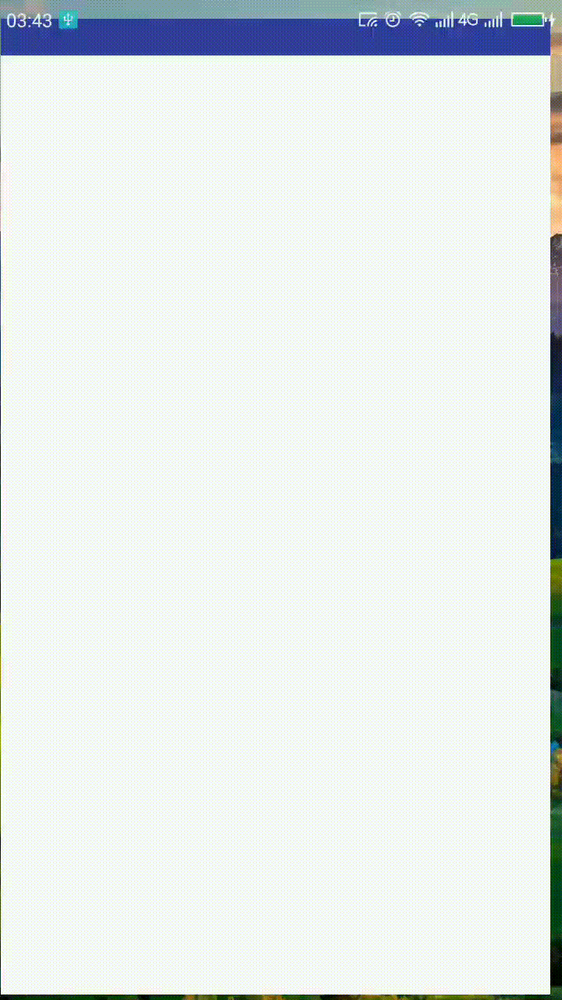

# ProgressAvatarView
模仿github 头像上的progress的效果写的

## Screenshot



## Usage

```Java
  // startAnim
  circleImageView.startAnim() 
  // stopAnim
  circleImageView.stopAnim()
```

```xml
  <cloudist.cc.library.ProgressAvatarView
    android:id="@+id/circle_image_view"
    android:layout_width="100dp"
    android:layout_height="100dp"
    android:src="@drawable/aaa"
    app:pav_border_width="5dp"
    app:pav_border_color="#FF000000"/>
```
